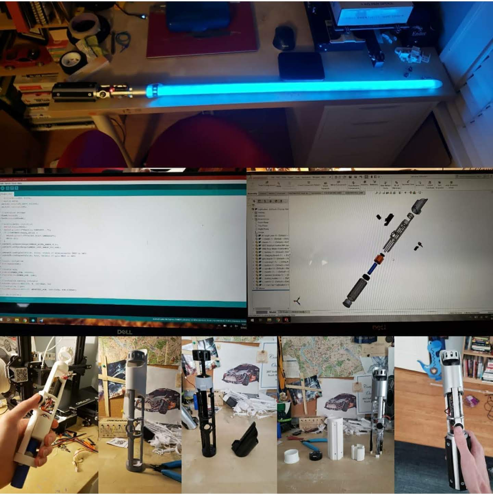

# Lightsaber

DIY Lightsaber project completed over the summer of 2020.
 

Features include:

- Sound effects including on, off, and hit sounds
- Realistic lightsaber swing sounds mimic Doppler Effect
- LED blade with light animations for on/off sequences & reactions to hits

The entire handle is custom 3D printed and hand painted.

Electronics are handled by an Adafruit Feather M4 microcontroller with the Adafruit propshield. An MPU6050 is used for accelometer and gyroscope data. Lighting is achieved through a Neopixel strip. The lightsaber is powered by an 18650 lithium cell.
